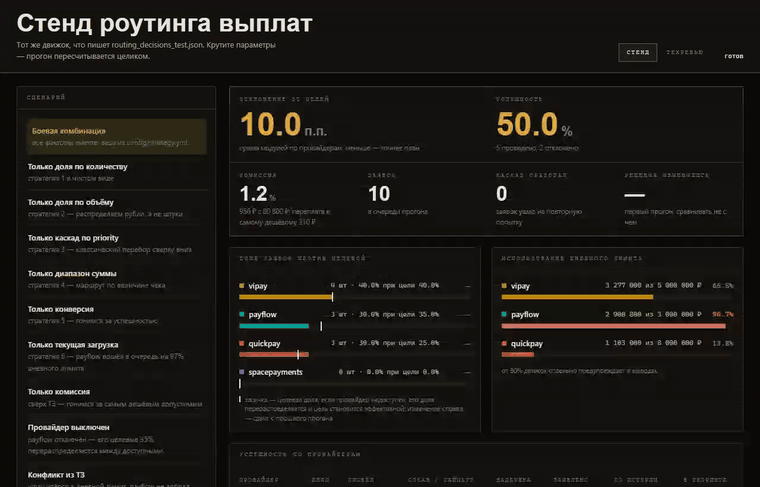
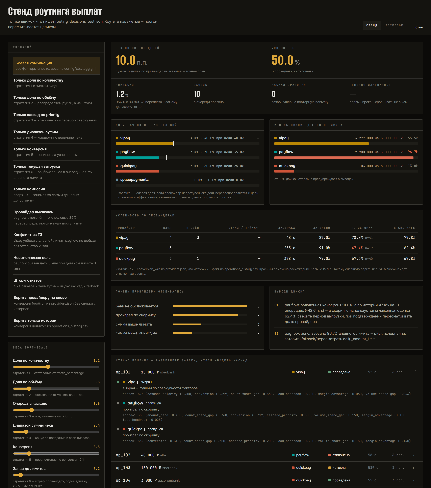
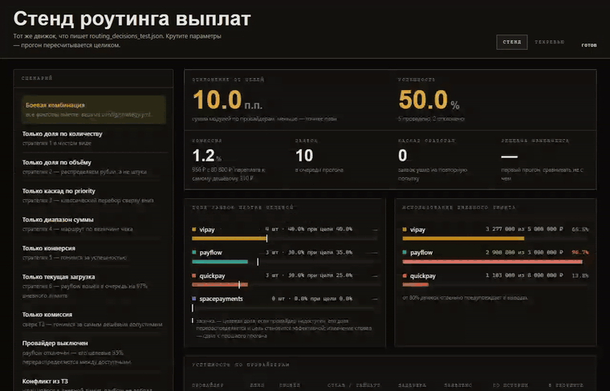
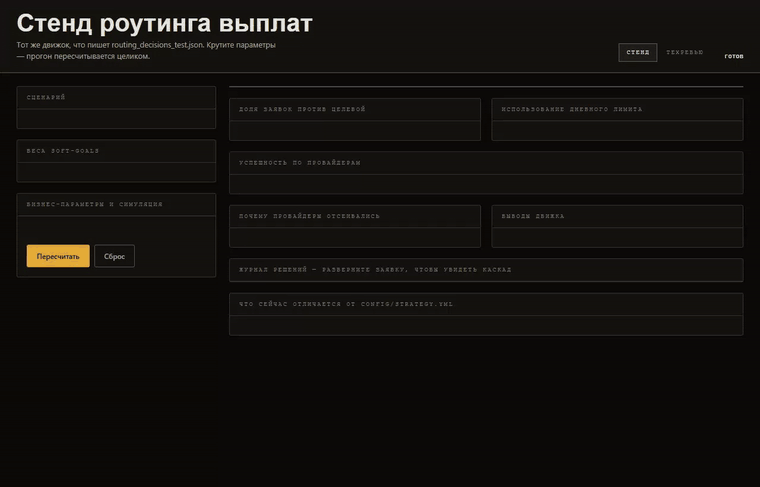
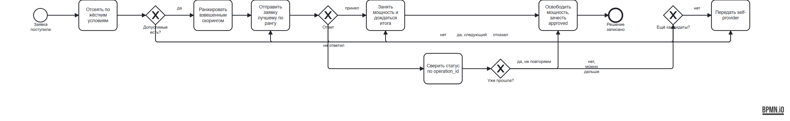

# Умный роутинг выплат

Движок распределения выплат между платёжными провайдерами: жёсткие условия допуска,
взвешенный выбор среди допущенных, каскад при отказе и таймауте, fallback на
self-provider, объяснение каждого решения и аналитика по итогам прогона.

**Ruby 3.3, только стандартная библиотека** — без гемов, сетевых вызовов и нейросетей ·
71 тест / 503 проверки · автопроверка организаторов 29 из 29 · прогон воспроизводим по seed

**Живой стенд:** <http://51.250.106.42:8787/> — движок считает на машине, не в браузере;
там же [разбор решений](http://51.250.106.42:8787/review). Без TLS: демо-стенд, ввода данных нет.



Политика роутинга здесь — конфигурация, а не код. Веса семи стратегий крутятся руками,
движок пересчитывает прогон целиком, а собранную политику можно унести файлом
`strategy.yml`, который воспроизведёт ровно тот же результат в батче.

**Содержание.** [Зачем это нужно](#зачем-это-нужно) ·
[Запуск](#запуск) ·
[Как это выглядит](#как-это-выглядит) ·
[Из чего состоит](#из-чего-состоит) ·
[Принятые решения](#принятые-решения) ·
[Стенд](#стенд) ·
[Тесты](#тесты)

Отдельными файлами: [сценарий демонстрации](docs/DEMO.md) ·
[допущения и открытые вопросы](docs/ASSUMPTIONS.md)

## Зачем это нужно

Маршрут выплаты — это не техническая деталь, а три статьи денег.

**Комиссия.** Провайдеры берут разное: vipay 1.2%, payflow 1.0%, quickpay 0.8%
при марже мерчанта 1.5%. Разброс в 0.4 п.п. на дневном лимите пула в 16 млн ₽ —
это **64 000 ₽ в день**. Поэтому стоимость участвует в выборе, а отчёт показывает
не только доли, но и во что распределение обошлось: эффективную ставку, уплаченную
комиссию и переплату относительно самого дешёвого допустимого провайдера.

**Конверсия.** Провайдеры заявляют о себе 87–91%, а история операций показывает
68%. Планировать по декларациям — значит систематически недовыплачивать и не
понимать причину. Движок сверяет заявленное с фактическим и говорит о расхождении
вслух.

**Обязательства.** `daily_turnover_min` — это договорённости с провайдером, за
которыми стоят тарифы. Недобор оборота стоит условий, поэтому он входит в скоринг
с самым высоким весом.

Задача движка — свести эти три вещи с целевыми долями трафика и жёсткими лимитами
так, чтобы каждое решение можно было объяснить и проверить.

## Запуск

```bash
# батч: очередь -> решения + отчёт
ruby bin/run.rb data/operations_queue_10.json data/providers.json \
                data/operations_history.csv config/strategy.yml \
                routing_decisions_10.json routing_report_10.json

# проверка автопроверялкой организаторов
ruby scripts/validate_10.rb routing_decisions_10.json

# тесты
ruby test/routing_test.rb

# интерактивный стенд -> http://127.0.0.1:8787
ruby bin/stand.rb
```

Без аргументов `bin/run.rb` берёт публичные `data/*` и пишет
`routing_decisions_test.json` / `routing_report_test.json` в корень репозитория —
то, что требуется к сдаче.

## Как это выглядит



Слева сценарии и веса, справа — пересчёт всего прогона: доли против целевых,
загрузка лимитов, стоимость, причины отсева и журнал решений с раскрытием каскада
по каждой заявке.

**Провайдер выключен.** payflow гаснет, и его целевые 35% перераспределяются между
доступными: vipay получает 61.5%, quickpay 38.5%. Роутер сверяется уже с эффективной
целью, а не с недостижимой записью в `providers.json`, и отчёт объясняет это словами.



**Почему выбран именно этот провайдер.** Каскад по заявке с разложением балла
по факторам: видно не только кто победил, но и что перевесило.



**Процесс маршрутизации одной заявки** — BPMN 2.0, исходник открывается в любом
моделере: [`docs/routing-process.bpmn`](docs/routing-process.bpmn).



## Из чего состоит

| Файл | Ответственность |
|---|---|
| `lib/hard_constraints.rb` | условия допуска: статус, диапазон суммы, дневной лимит, in-progress, реквизиты, маржа, банки, интенсивность |
| `lib/strategy_scorer.rb` | soft-goals: взвешенная сумма отклонений от целей — так несколько стратегий учитываются совместно |
| `lib/router.rb` | каскад по одной заявке: фильтр → ранжирование → попытки → fallback |
| `lib/simulator.rb` | детерминированная симуляция приёма заявки и итога, seed в конфиге |
| `lib/provider.rb`, `lib/provider_pool.rb` | состояние провайдеров, резерв/освобождение мощности, калибровка по истории |
| `lib/report_builder.rb` | аналитика и рекомендации |
| `lib/pipeline.rb` | сборка прогона целиком; используется и батчем, и стендом |
| `bin/stand.rb`, `web/` | демо-стенд: те же параметры крутятся в браузере |

## Принятые решения

**Hard и soft разведены строго.** Жёсткие условия отвечают «можно ли вообще
отправить эту заявку этому провайдеру» и применяются до стратегии. Soft-goals
отвечают «кого предпочесть среди допущенных» и на допуск не влияют.

**Конфликт целей решается скорингом, а не цепочкой if.** Все семь стратегий из
задания — доля по количеству, доля по объёму, каскад по priority, диапазон суммы,
конверсия, текущая загрузка, финобязательства — сведены к взвешенной сумме в
`config/strategy.yml`. Поменять политику значит поменять веса, а не код.
Отклонения долей клипуются (`GAP_CLAMP`), иначе один фактор перевешивает остальные.

Факторы лежат в реестре `StrategyScorer::FACTORS`. Добавить новое правило —
это одна запись в реестре плюс вес в конфиге: объяснение выбора, лог попыток и
отчёт разбирают реестр сами, списка факторов «поимённо» в коде больше нет.
Вес без фактора (опечатка в конфиге) не молчит, а печатает предупреждение, и
отдельный тест сверяет боевой конфиг с реестром.

**Объяснение показывает вклад, а не только балл.** В каждой попытке пишется
разложение `score` по факторам — `score=1.239 (amount_band +0.400, count_share_gap
+0.360, conversion +0.312, cascade_priority +0.300, volume_share_gap -0.150,
load_headroom +0.017)`. Имена совпадают с ключами весов в конфиге, поэтому из лога
сразу видно, какой параметр крутить, чтобы решение изменилось.

**Загрузка влияет на выбор, а не только на допуск.** Провайдер, подходящий
вплотную к лимиту, проигрывает более свободному, даже когда формально проходит
проверки. Штраф не линейный, а пороговый (`load.pressure_threshold_pct`):
различать провайдера на 15% и на 65% занятости смысла нет — с линейной версией
фактор превращался в постоянную фору самому пустому провайдеру и в одиночку
определял всё распределение (отклонение от целевых долей росло с 10 до 50 п.п.).

Вес 0.2 подобран замером, а не на глаз. Протокол: публичная очередь из десяти
заявок, сиды симуляции 1–40, меняется только вес одного фактора.

| вес | среднее отклонение от целей | пиковая загрузка payflow |
|---|---|---|
| 0.2 | 20.8 п.п. | 99.6% |
| 0.3 | 36.5 п.п. | 99.6% |
| 0.5 | 39.5 п.п. | 99.6% |

Высокий вес платит десятками пунктов плана и **не покупает взамен ничего**:
пиковая загрузка не сдвигается вовсе. Причина в данных — payflow входит в
очередь уже на 96.7% дневного лимита, и никакое понижение в ранге не отменяет
заявок, которые проходят только по нему. На публичной десятке при
0.2 фактор не переворачивает ни одной заявки — он входит в баллы и начинает
менять маршрут с 0.3, что видно на стенде пресетом «Только текущая загрузка».

**Долю закрывает только успешная операция.** `routed_count`, `routed_volume` и
`daily_approved_amount` растут при `approved`, а не при любой выбранной попытке:
неудавшаяся выплата не должна засчитываться провайдеру как выполненная квота.

**«Отказал» и «не ответил» — разные случаи.** При явном отказе можно сразу идти
к следующему провайдеру. При таймауте статус выплаты неизвестен, и повтор без
сверки рискует задвоить живые деньги — поэтому перед fallback выполняется
идемпотентная проверка статуса по `operation_id`, и это отражено в объяснении
попытки. В формулировке кейса стоит «отказывает **или не отвечает**» — это
разные ветки, а не синонимы.

**Мощность резервируется, а не списывается навсегда.** `available_requisites` и
`in_progress_*` занимаются в момент выбора и освобождаются, когда исход известен —
при любом исходе. Иначе на длинной очереди провайдер необратимо уходит в ноль
реквизитов и выпадает из пула.

**Заявленной конверсии не верим на слово.** `conversion_24h` в `providers.json` —
это то, что провайдер о себе сообщает. По `operations_history.csv` payflow
заявляет 91%, а фактически проводит 47,4% на 19 операциях. В скоринг идёт
сглаженная оценка: декларация входит как `conversion.prior_strength` «виртуальных
наблюдений» против фактических из истории — при малой выборке история сама шумит,
поэтому не заменяем одно другим, а взвешиваем. Расхождение больше 15 п.п.
попадает в рекомендации отдельной строкой.

Что именно даёт сглаживание, стоит сказать точно — выгода видна не во всех
сравнениях. Против веры **только истории** оно выигрывает много: на публичной
десятке 10 п.п. отклонения от целей против 50, на 40 сидах 20.8 против 35.2.
Против веры **только декларации** по отклонению не выигрывает ничего (20.8
против 20.5 п.п.) — но даёт 7.4 успешных заявки из 10 вместо 8.8. Падение здесь
и есть польза: по истории конверсия пула 68%, и прогон, обещающий 88%, просто
приукрашен.

**Недостающие поля заданы явно и помечены как допущение.** `requests_per_minute_limit`
и `daily_turnover_min` из `providers.json` не выводятся; они лежат в
`provider_overrides` с комментарием. Оттуда же переопределяется любой штатный
параметр провайдера — это позволяет менять сценарий, не трогая входные данные.

**Комиссия влияет на выбор, а не только на допуск.** В жёстких условиях маржа
проверяется порогом «не хуже соглашения»; в скоринге она работает предпочтением —
среди допущенных выгоднее тот, кто оставляет площадке больше. Вес 0.3 подобран
тем же замером — публичная очередь, сиды 1–40:

| вес | эффективная ставка | переплата против самого дешёвого | отклонение от целей |
|---|---|---|---|
| 0.3 | 0.934% | 361 ₽ | 20.8 п.п. |
| 0.5 | 0.918% | 314 ₽ | 35.5 п.п. |

Вывод, который стоит сказать вслух: при заданных целевых долях экономия на
комиссии почти исчерпана. Удвоение веса выигрывает 47 ₽ на десяти заявках и
стоит 15 пунктов плана — план жёстче, чем разброс тарифов. Отчёт считает это
в рублях, чтобы решение принимали не на ощущениях.

**Цель недоступного провайдера перераспределяется.** Доля, назначенная тому,
кому нельзя отдать ни одной заявки (выключен, без реквизитов, дневной лимит
исчерпан, маржа хуже соглашения), — это дефект входных данных, а не задача
роутера: сколько трафика туда ни направляй, план не закроется. Такая доля
раскладывается между оставшимися пропорционально их собственным целям, сумма
эффективных целей снова равна 100%, и роутер сверяется с `effective_target_pct`.
Без этого доступные провайдеры вечно выглядели бы «перебравшими план», скоринг
давил бы их вниз, а рекомендации предлагали бы снижать `traffic_percentage` тем,
кто ни в чём не виноват. Отчёт называет провайдера, причину и то, кому ушла доля.
Цели пересчитываются перед каждой заявкой — провайдер может выбыть по ходу
очереди, и с этого момента его долю подхватывают оставшиеся.

**Отчёт объясняет причину, а не только фиксирует отклонение.** Если провайдер
недобрал долю потому, что его отсекало жёсткое ограничение, — правка весов не
поможет, и отчёт прямо это говорит. Отдельно ловится цель, невыполнимая по
конструкции конфига: `daily_turnover_min` больше дневного лимита того же провайдера.

**Прогон воспроизводим.** Seed зафиксирован в конфиге, один и тот же вход даёт
побайтово тот же выход — иначе перепроверка не сойдётся.

## Стенд

`ruby bin/stand.rb` поднимает локальный сервер на стандартной библиотеке
(`socket` + `json`) и отдаёт две страницы.

`/` — интерактивный стенд: те же параметры конфига крутятся руками (веса
стратегий, бизнес-параметры провайдеров, доверие к заявленной конверсии,
интенсивность отказов). Каждое изменение — полный пересчёт движком, с показом
того, какие заявки сменили провайдера и почему.

`/review` — техревью: архитектура и поток данных, разбор каждого принятого
решения, замеры, которыми подобраны веса, и допущения, сказанные вслух.
Числа на странице взяты из фактических прогонов.

Готовые сценарии на странице: каждая стратегия по отдельности, конфликт целей
из текста задания, выключенный провайдер с перераспределением его доли,
невыполнимое финобязательство, шторм отказов и два режима доверия к конверсии.

### Выгрузка политики

Стенд, из которого нечего унести, — игрушка. Поэтому любой прогон выгружается
тремя файлами:

| Файл | Что это |
|---|---|
| `strategy.yml` | политика, собранная ползунками, в том же формате, что читает `bin/run.rb` |
| `routing_decisions.json` | решения этого прогона — формат сдачи |
| `routing_report.json` | отчёт этого прогона |

Круг замкнут и проверен: выгруженный `strategy.yml`, поданный в `bin/run.rb`
четвёртым аргументом, даёт побайтово те же решения, что стенд показал на экране.
То есть подобранная руками политика уезжает в батч и в CI без переписывания.

### Если стенд смотрит наружу

Сервер слушает только `127.0.0.1`. Публичная выдача — осознанное действие через
переменную окружения `STAND_HOST=0.0.0.0`, а не поведение по умолчанию.

Для публичного адреса у каждого соединения есть бюджет, иначе демо-сервер кладётся
одним curl: тело запроса не больше 256 КБ, не больше 64 заголовков, 15 секунд на
всё соединение, 24 одновременных запроса и 40 запросов с адреса за 10 секунд.
Причина конкретная: `POST /api/run` прогоняет весь движок, а молчащий клиент
раньше удерживал поток навсегда. Проверено не глазами — сервер обстрелян
выдуманным `Content-Length`, флудом заголовков и молчащими сокетами; отвечает
413, 431 и 429 и остаётся живым.

## Тесты

```
ruby test/routing_test.rb    # 71 тест, 503 проверки
```

Покрыты: каждое жёсткое ограничение по отдельности, резерв и освобождение
мощности, начисление квоты только по успешным, скоринг и отключение фактора
нулевым весом, вклад фактора как значение x вес, стоимость распределения и
её граничные случаи, сверка боевого конфига с
реестром факторов, пороговый штраф за загрузку на всех границах и по самой
узкой оси лимита, перераспределение доли недоступного провайдера, сглаживание
конверсии на границах, каскад при отказе и таймауте, fallback на self-provider,
синхронность кодов причин между движком и отчётом, воспроизводимость по seed,
схема выходного файла и граничные случаи — пустая очередь и заявка, которую
не берёт никто.

Тесты проверены мутациями: движок ломается намеренно (отключается штраф за
загрузку, вклад считается без веса, цели перестают перераспределяться, берётся
не самая узкая ось лимита) — каждая мутация роняет тесты. Зелёный прогон сам по
себе ничего не доказывает.
